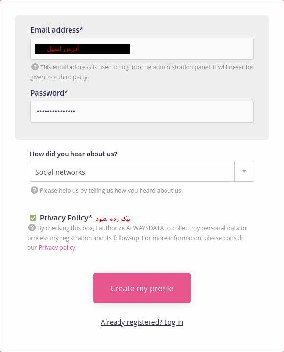
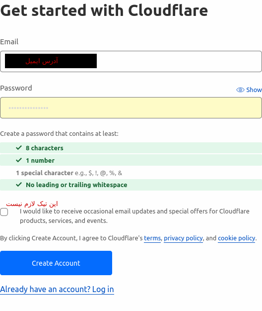
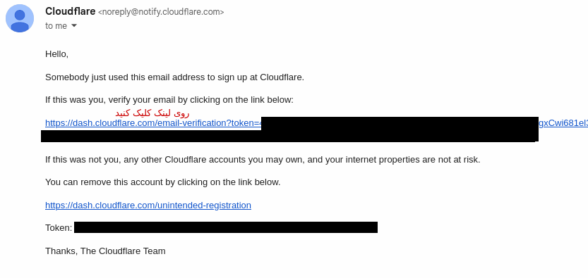

## ساخت حساب
موقع ساخت حساب alwaysdata حتما از فیلترشکن استفاده نکنید، باعث میشه ازتون کارت اعتباری معتبر بخواد. باید با همچین صفحه ای مواجه بشید :

مشخصات رو طبق تصویر وارد کنید و بر روی create my profile کلیک کنید.
برای اطلاع رسانی یک ایمیل براتون ارسال میشه ولی نیازی به فعال سازی حسابتون نیست.

برای کلاودفلر هم همین کارو کنید.

همونطور که تو تصویر میبینید باید یک پسوردتون حداقل ۸ کارکتری و شامل یک عدد و یه کاراکتر ویژه باشه (خودش مثال زده).
برای کلاودفلر باید ایمیلتون رو تأیید کنید.

[بعدی](prep)
