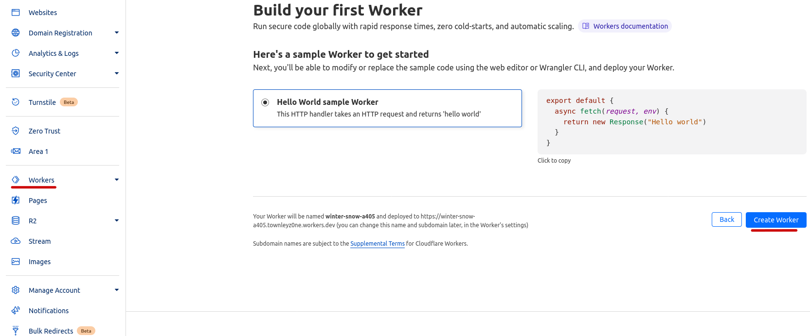
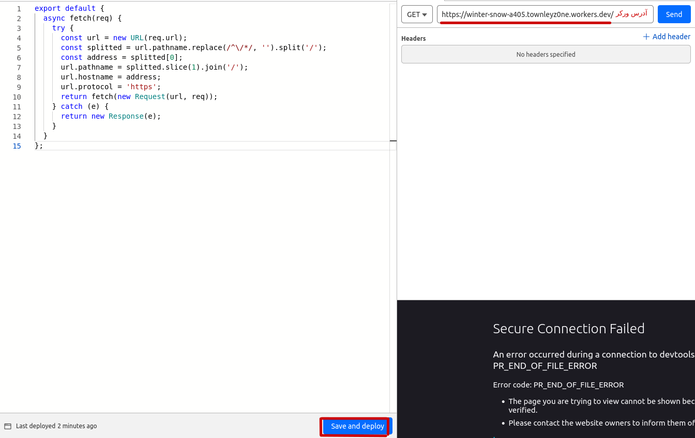
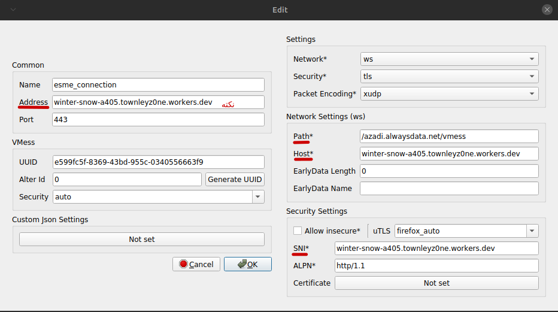

## کلاودفلر
در مرحله قبلی با موفقیت به سرورمون وصل شدیم. مشکلی که هست اینه که ارتباطمون مستقیمه و عمو سانسورچی میتونه به راحتی برامون مشکل درست کنه. برای جلوگیری و رفع این مشکل میتونیم از کلاودفلر استفاده کنیم.

وارد [پنل کلاودفلرمون](https://dash.cloudflare.com) میشیم

از پنل سمت چپ گزینه worker رو انتخاب میکنیم و سپس create رو میزنیم.

کد سمت چپ صفحه رو با کد زیر جا به جا میکنیم :

    export default {
      async fetch(req) {
        try {
          const url = new URL(req.url);
          const splitted = url.pathname.replace(/^\/*/, '').split('/');
          const address = splitted[0];
          url.pathname = splitted.slice(1).join('/');
          url.hostname = address;
          url.protocol = 'https';
          return fetch(new Request(url, req));
        } catch (e) {
          return new Response(e);
        }
      }
    };

و بعد روی Save and deploy کلیک میکنیم.
ازمون سوال میپرسه که آیا مطمئنیم و ما هم تأیید میکنیم.

آدرس ورکرمون رو یادداشت میکنیم که لازمش داریم.

اگر صفحه ورکر رو باز کنیم باید با ارور bad request مواجه بشیم.

حالا تنظیمات کانکشنمون همچین چیزی میشه

خواهشا در وارد کردن تنظیمات دقت کنید.
در فیلد نکته دار شما میتونید از دامنه یک سایتی که پشت کلاودفلر هست و یا آی پی تمیز استفاده کنید. برای آی پی تمیز میتونید از [کد آقا فرید](https://vfarid.github.io/cf-ip-scanner/) به راحتی استفاده کنید.

سرور vmess مستقیم

    vmess://ewogICAgImFkZCI6ICJhemFkaS5hbHdheXNkYXRhLm5ldCIsCiAgICAiYWlkIjogIjAiLAogICAgImhvc3QiOiAiYXphZGkuYWx3YXlzZGF0YS5uZXQiLAogICAgImlkIjogImU1OTlmYzVmLTgzNjktNDNiZC05NTVjLTAzNDA1NTY2NjNmOSIsCiAgICAibmV0IjogIndzIiwKICAgICJwYXRoIjogIi92bWVzcyIsCiAgICAicG9ydCI6ICI0NDMiLAogICAgInBzIjogImVzbWVfY29ubmVjdGlvbiIsCiAgICAic2N5IjogImF1dG8iLAogICAgInNuaSI6ICJhemFkaS5hbHdheXNkYXRhLm5ldCIsCiAgICAidGxzIjogInRscyIsCiAgICAidHlwZSI6ICIiLAogICAgInYiOiAiMiIKfQo=

سرور vmess پشت کلاودفلر

    vmess://ewogICAgImFkZCI6ICJ3aW50ZXItc25vdy1hNDA1LnRvd25sZXl6MG5lLndvcmtlcnMuZGV2IiwKICAgICJhaWQiOiAiMCIsCiAgICAiaG9zdCI6ICJ3aW50ZXItc25vdy1hNDA1LnRvd25sZXl6MG5lLndvcmtlcnMuZGV2IiwKICAgICJpZCI6ICJlNTk5ZmM1Zi04MzY5LTQzYmQtOTU1Yy0wMzQwNTU2NjYzZjkiLAogICAgIm5ldCI6ICJ3cyIsCiAgICAicGF0aCI6ICIvYXphZGkuYWx3YXlzZGF0YS5uZXQvdm1lc3MiLAogICAgInBvcnQiOiAiNDQzIiwKICAgICJwcyI6ICJlc21lX2Nvbm5lY3Rpb24iLAogICAgInNjeSI6ICJhdXRvIiwKICAgICJzbmkiOiAid2ludGVyLXNub3ctYTQwNS50b3dubGV5ejBuZS53b3JrZXJzLmRldiIsCiAgICAidGxzIjogInRscyIsCiAgICAidHlwZSI6ICIiLAogICAgInYiOiAiMiIKfQo=

پ.ن: nekoray همه فیلد هارو درست export نمیکنه، تنظیمات سرور نمونه رو بعد وارد کردن، درست کنید!
