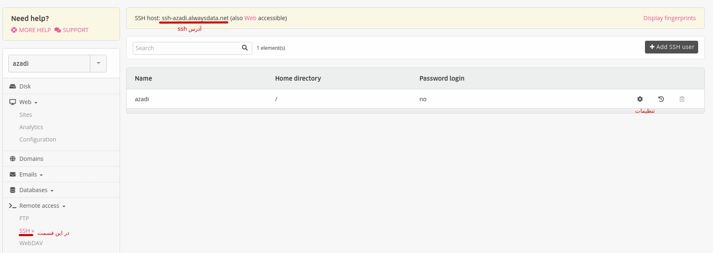
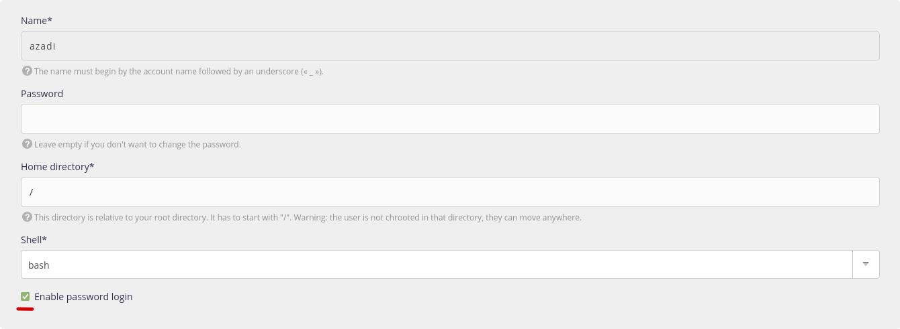

## تنظیمات سایت
در پنل alwaysdata وارد قسمت Remote access > ssh بشید.

اسم یوزر پیشفرض با اسم سایت یکیه. با کلیک بر روی چرخ دنده جلو اسم وارد تنظیمات حساب بشید و تیک enable password login رو بزنید و در آخر بر روی submit کلیک کنید.

[بعدی](ssh)
