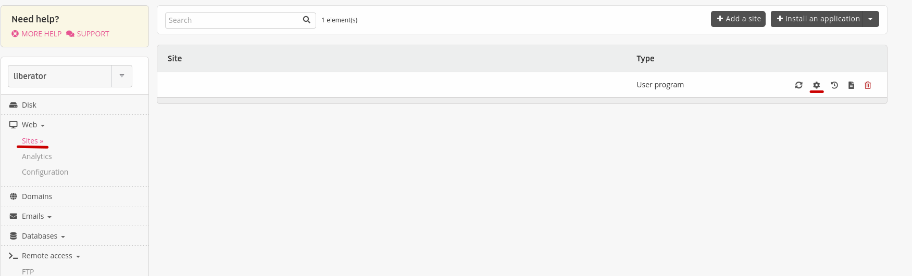
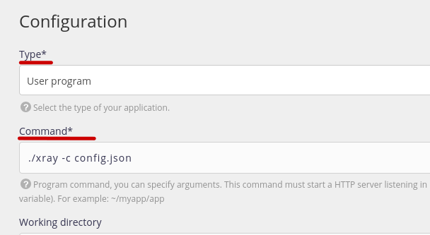
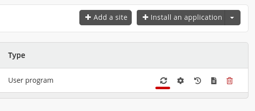
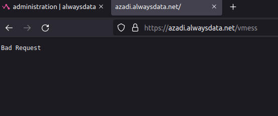
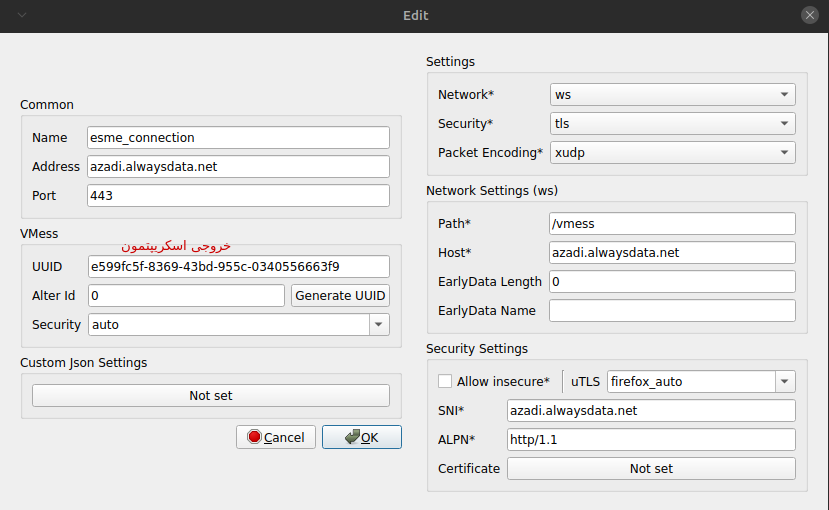

## تنظیمات سایت و اتصال
از قسمت Web وارد Sites بشین و تنظیمات سایتتون رو ویرایش کنید

وارد تب advanced بشید و مقدار idle time رو به صفر تغییر بدید. اما هنوز submit رو نزنید و برگردید قسمت configuration
type رو به user program تغییر بدید و دستور زیر رو وارد قسمت command کنید:

    ./xray -c config.json

حالا بر روی submit کلیک کنید.

برگردید لیست site ها و روی restart کلیک کنید

اگر با مشاهده دایرکتوری /vmess سایتتون با همچنین پیامی رو به رو شدید، یعنی تا اینجا همه چیز رو درست انجام دادید.

تنظیمات اتصالتون همچین چیزی میشه

alpn (h2, http/1.1) و uTLS های مختلف رو امتحان کنید، از هرچی وصل شد میتونید استفاده کنید.

[بعدی](cloudflare)
