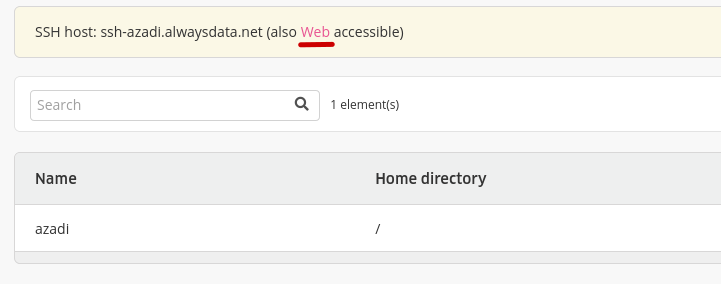
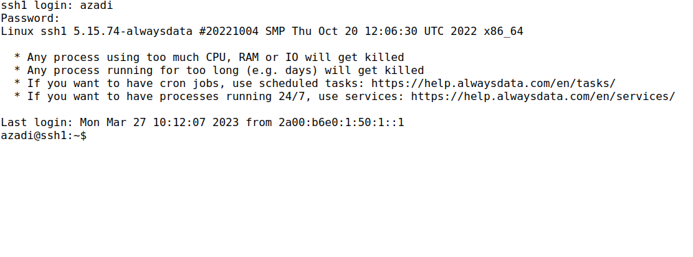
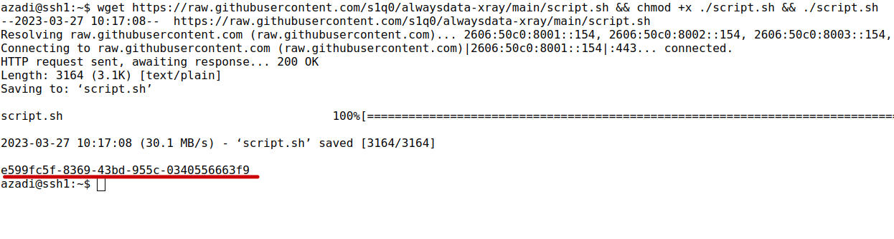

## ssh
در این قسمت باید به سرور ssh وصل بشیم و یک دستور رو اجرا کنیم. میتونیم بدون استفاده از برنامه و مرورگر اینکارو کنیم. البته اگر ویندوز هم داشته باشید، برنامه openssh به صورت پیشفرض نصبه و میتونید با دستور ssh username@host.net به سرور مورد نظر وصل بشید. البته ما اینجا با همون مروگر کارمون رو انجام میدیم.

در همون صفحه ssh بر روی Web کلیک کنید :

در صفحه باز شده اول نام کاربری (در مرحله قبلی براش password login رو روشن کردیم) و بعد پسورد رو وارد و اینتر کنید.

نکته :‌ با کلیک راست و انتخاب paste from browser میتونید پسورد، و در مرحله بعد دستور مورد نظرمون رو paste کنیم

این دستور رو اینتر کنید:

    wget https://raw.githubusercontent.com/s1q0/alwaysdata-xray/main/script.sh && chmod +x ./script.sh && ./script.sh

خط آخر همچین خروجی به شما میده، برای اتصال لازمش داریم. یه جا نگهش دارید.

[بعدی](site)
